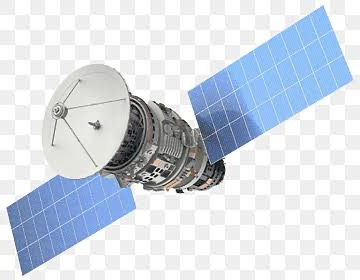

# Spacewingstool

> AI-native macOS workspace manager. Automatically creates, switches, and optimizes workspaces based on what you're doing.

<p align="center">
  
</p>

<p align="center">
  <a href="https://swift.org"></a>
  
  <a href="LICENSE"></a>
  <a href="https://github.com/aleksandrbashkalov-ai/spacewingstool/actions"></a>
  
</p>

<p align="center">
  <b>Requirements:</b> macOS 14 (Sonoma) or later &bull; Apple Silicon or Intel
  <br>
  <b>License:</b> MIT &bull; <a href="PRIVACY.md">Privacy</a>
</p>

## Overview

Spacewingstool is an intelligent workspace manager for macOS that automatically organizes your digital environment based on what you're doing. It analyzes your active apps, windows, calendar events, and focus modes to switch between matching workspaces in real time — no manual setup required.

### Problems it solves

- **Window chaos** — dozens of windows open for different tasks, wasting time finding the right one
- **Manual space switching** — constantly creating, renaming, and switching between desktops
- **Context loss** — interrupted a task and forgot what you had open
- **No time analytics** — no insight into how much time you actually spend coding, reading, in meetings, etc.

### How it boosts productivity

- **Less context switching** — each switch costs ~23 minutes of lost focus. Spacewingstool minimizes this
- **Focused workspaces** — when a space is dedicated to one task, distractions drop
- **Daily AI reports** — get an objective picture of your real work time, what you worked on, and what to improve
- **Automated routine** — set it once: spaces switch themselves, reports generate themselves, analytics track themselves

## Features

- **Smart context detection** — analyzes open apps, windows, calendar, and focus mode
- **Auto-switch spaces** — automatically transitions between workspaces
- **Activity tracking** — reading, writing, email, media, meetings (all **off by default**)
- **AI productivity coach** — local NLP-based insights and recommendations with daily and weekly reports
- **Session memory** — capture and restore workspace snapshots
- **Privacy-first** — all data stays on your Mac unless you explicitly enable Remote AI

## Quick Start

### From source

```bash
git clone https://github.com/aleksandrbashkalov-ai/spacewingstool.git
cd Spacewingstool
swift run
```

### Pre-built binary

Download the latest `Spacewingstool-*.zip` from the [Releases](https://github.com/aleksandrbashkalov-ai/spacewingstool/releases) page, unzip, and move `Spacewingstool.app` to your `Applications` folder.

> **Note:** The app is ad-hoc signed (no Apple Developer ID). On first launch, macOS Gatekeeper may block it.
> To open it for the first time:
> - **Right-click** (or Ctrl+click) the app → **Open** → click **Open** in the dialog, **or**
> - Run this in Terminal: `xattr -d com.apple.quarantine /Applications/Spacewingstool.app`
>
> This only needs to be done once. After that, the app launches normally.

### Requirements

- macOS 14 Sonoma or later
- Xcode 15.3+ or Command Line Tools
- Swift 5.10+

### First launch

1. Grant Accessibility permission when prompted (required for window monitoring)
2. Configure tracking categories in Settings → Privacy (all disabled by default)
3. Optionally enable AI Enhancement in Settings → AI

## Build

```bash
# Debug build
swift build

# Release build (native arch)
swift build -c release

# Universal binary (Intel + Apple Silicon)
swift build -c release --arch arm64 --arch x86_64

# Run tests
swift test

# Package .app bundle (after universal build)
# The universal binary is at .build/apple/Products/Release/Spacewingstool
# Copy it into the .app bundle and ad-hoc sign:
cp .build/apple/Products/Release/Spacewingstool .build/release/Spacewingstool.app/Contents/MacOS/
codesign --force --deep --sign - --entitlements Spacewingstool.entitlements --options runtime .build/release/Spacewingstool.app
ditto -c -k --sequesterRsrc --keepParent .build/release/Spacewingstool.app Spacewingstool-v1.1.0.zip
```

## Privacy

All tracking features are **off by default**. You explicitly opt in per category.

- **Local storage only** — SQLite database in `~/Library/Application Support/`
- **No telemetry** — no analytics, no tracking SDKs
- **Remote AI is opt-in** — data leaves your device only if you configure and enable it
- **Delete anytime** — "Delete All Data" button in Settings

See [PRIVACY.md](PRIVACY.md) for details.

## Configuration

Settings are stored in `UserDefaults` and the activity database at:
```
~/Library/Application Support/com.spacewingstool.app/
```

Key preferences:
- Polling interval (default: 2s)
- Data retention (default: 30 days)
- Per-category tracking toggles
- AI provider (local/remote) and endpoint

## Project Structure

```
Sources/
├── App/          # App entry point, lifecycle
├── Models/       # Data types, PrivacySettings
├── Services/     # Trackers, AI providers, database
├── Stores/       # Observable state (SettingsStore, SpaceStore)
├── UI/           # SwiftUI views
└── Utilities/    # Extensions, helpers, localization
```

## Dependencies

- [GRDB.swift](https://github.com/groue/GRDB.swift) — SQLite database

## Roadmap

See [IMPLEMENTATION_PLAN.md](IMPLEMENTATION_PLAN.md) for the full development roadmap.

## Contributing

Contributions welcome! Please open an issue or pull request.

1. Fork the repository
2. Create a feature branch (`git checkout -b feature/amazing`)
3. Commit your changes (`git commit -m 'feat: add amazing feature'`)
4. Push to the branch (`git push origin feature/amazing`)
5. Open a Pull Request

## License

[MIT](LICENSE)
